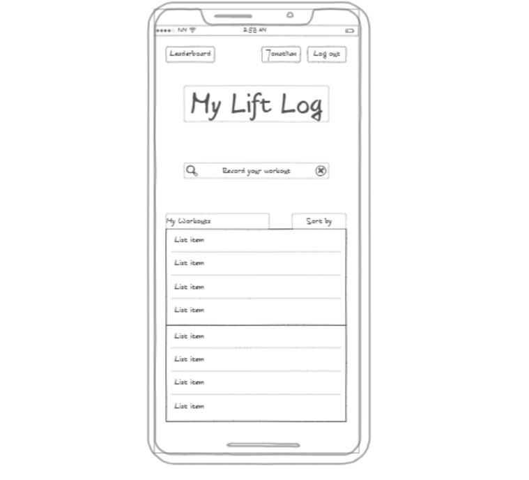

# Startup: The Lift Log

## Description deliverable

### Elevator pitch
Tracking your reps and weights is essential for progressing in the gym, but using notes apps and cluttered bullet point lists or Excel spreadsheets to track this progress is more difficult than it needs to be. The Lift Log makes recording your weights seamless. You just put in your most recent weight and reps for a workout, and the Lift Log will take care of the rest, creating your personal, easily searchable and quickly updatable Log.

### Design

Here is a mockup of the Lift Log running on an iPhone after the user has logged in. 

### Key features

- Secure login over HTTPS
- Persistently stored record of workouts with most recent weight and rep count for each workout
- Quick add option that allows user to either add a workout if not in database or search and update a current workout
- Log can be sorted by highest weight, highest reps, or most recent workout
- User can delete workouts from their Log
- Leaderboard page where users can view friend's workouts

### Technologies

I will use the required technologies in the following ways.

- **HTML** - Uses correct HTML structure for application. Three HTML pages. One for login, one for the user's Log, and one for viewing friend's Logs. Hyperlinks connect each page.
- **CSS** - Application styling that looks good on different screen sizes, uses good whitespace, color choice and contrast.
- **JavaScript** - Provides login, sorting user's Log, and backend endpoint calls for search, updating database, and viewing leaderboards.
- **Service** - Backend service with endpoints for:
  - login
  - retrieving stored workouts
  - inputting new workouts
  - viewing friend's Logs
- **DB** - Store users and logs of workouts in database.
- **Login** - Register and login users. Credentials securely stored in database.
- **WebSocket** - Saved workouts are made available to see by user's friends.
- **React** - Application ported to use the React web framework.

## HTML deliverable

For this deliverable I built out the structure of the application using HTML.
- **HTML pages** - Three unique HTML pages, one for the login screen, one for logged in view of the Log, and the third to view the leaderboard.
- **Links** Login page links to logged in page, and the logged in page has links to log back out and go to the leaderboard page. The leaderboard link is replaced with a "Return to my log" link on the leaderboard page.
- **Text** - I included dummy text to represent the future stored workout data.
- **3rd party services** - A third party database will be used for storing workout logs to be called on later.
- **Images** - I don't think I will include an image in the final result, but I wanted to include an image in this deliverable just to practice using the img tag. It is a DALL-E generated image of a bodybuilder and is featured on the login page.
- **Login** - Input box and submit button for login.
- **Database** - The different listed workouts on the logged in page and the leaderboard page represent data pulled from the database.
- **WebSocket** - The workout log data will be updated in realtime once the user inputs a workout in the logged in page.

## CSS deliverable

For this deliverable I properly styled the application into the visual appearance from my original mockup.
- **Header, footer and main content body** - All properly created and placed!
- **Navigation elements** - I properly aligned one menu to the left and the other to the right to create a separation of navigation tasks.
- **Response to window resizing** - My app properly resizes on PC and phones.
- **Application elements** - Used themed colors for buttons and hovering on menus and added whitespace.
- **Application text content** - Consistent fonts.
- **Application images** - Still using my good ol' Dall-E image on the landing page (for now)!

## JavaScript deliverable

For this deliverable I implemented initial functionality using JavaScript so that the application works for a single user. I also added placeholders for future technology.
- **login** - When you press enter or the login button it takes you into the Log page.
- **database** - Workouts are started in local storage as a placeholder for the future database data.
- **WebSocket** - I also dynamically update the Log list in real time with the stored workouts in reverse order of when they were added.
- **application logic** - I've begun setting up some of the basic functionality with the ability to sort workouts by Weight, Reps, or Date in the Stats page. There is also working functionality for moving forward and backward through dates. I'm also currently working on making a Logbook object that will map the workouts arrays to the current date and display the proper workouts list for the selected date.

## Service deliverable

For this deliverable I added backend endpoints to receive and return stored workouts.
- **Node.js/Express HTTP service** - done!
- **Static middleware for frontend** - done!
- **Calls to third party endpoints** - Added call to API for motivational gym quotes.
- **Backend service endpoints** - Placeholders for login that stores the current user on the server. Endpoints for logged workouts.
- **Frontend calls service endpoints** - I did this using the fetch function.
